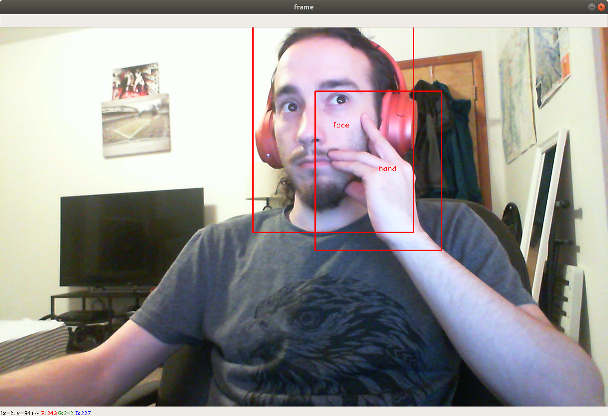
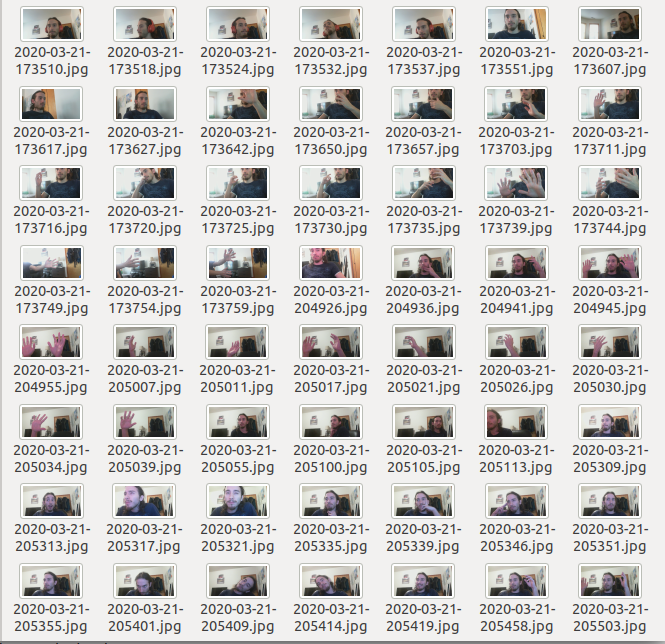

# donttouchyourface

A Machine Learning application that verbally warns the user if they touch their face

### The things you need to build your own

  - CUDA (Optional)
    - Used during the training process to save time
  - YOLOv3 
    - Used for realtime object detection
  - Your data set to train and test the model
    - At least 60 pictures (30 pictures for face and 30 pictures for hand)
  - OpenCV 
    - Used for capturing images from webcam and image processing
  - PyGame
    - Used for playing sound files 
  - Camera

### A quick summary of what I did

- Step 1- Created a small dataset which contains images of my face and hands
- Step 2- Trained a YOLOv3 model using the dataset
- Step 3- After 3 hours of training, the model learned to detect and localize my face and hands in an image
- Step 4- Used the AWS Polly speech synthesis tool to create a few funny audio files to warn my self
- Step 5- Finally, I created a Python script that captures images from my webcam, uses the pre-trained model for inference and warns me if my hand gets too close to my face



**Link to the Project Video:** https://www.linkedin.com/embed/feed/update/urn:li:ugcPost:6647733944861159424?compact=1

### My ancient test system
- GPU: Nvidia GTX 1050Ti 4GB
- CPU: Intel i5-3470
- RAM: 12GB
- OS: Ubuntu 18.04

---

### Detailed steps

**- Step 1-** Create a small dataset which contains images of your face and hands.
   - **1.A: Setup dataset directory and class name files**
     - Create new directory called ```dataset```
     - ```mkdir dataset```
     - ```cd dataset```
     - Create a new .txt file called ```classes.txt```
     - Open classes.txt with your favorite text editor such as nano and gedit etc
     - Type the following class names in a new line:
        - face
        - hand
      - Save the file. We will use this file dataset labeling process.
  - **1.B: Install cheese to take pictures**
    - ```sudo apt install cheese```
  - **1.C: Take pictures of your hands and face**
    - I took 30 hand pictures and 30 face pictures. Remember the more the better!
      - 20 for training and 10 for testing for each class.
      - You will have all your pictures in one folder, so make sure the dataset is shuffled.
      
      - Example image dataset:
      
      
  - **1.D: Label your data set using the labelImg tool**
    - There are several different tools to do this step. I used https://github.com/tzutalin/labelImg
    - Follow their instruction to install labelImg then run:
      - ```python3 labelImg.py /home/melih/Desktop/dataset /home/melih/Desktop/dataset/classes.txt```
    - Click on the ```Change Save Dir``` button and choose your dataset directory. Because, we want our images and their labels to be in the same directory.
    - The default save format is ``Pascal/VOC``, so change it to ``YOLO``.
    - Press on ```W``` to draw a rectangle in the image to label.
    - Select the class type
    - Save the image and go to the next image.
    - Repeat this process for all the images in the dataset.

    

**- Step 2-** Train a YOLOv3 model using your dataset
  - **2.A: Install Darknet:**
    - https://pjreddie.com/darknet/install/
    - Also, Install CUDA https://developer.nvidia.com/cuda-downloads. Trust me, you want to use an Nvidia GPU with CUDA to do this.
  - **2.B: Download the pre-trained model (darknet53.conv.74)**
    - darknet53.conv.74 is trained on Imagenet dataset. We want to use because it is better to begin with some pre-trained weights than complete random weights.
      - ```wget https://pjreddie.com/media/files/darknet53.conv.74```
  - **2.C: Train a model using your data set**
    - You can follow the YOLO training instruction at https://pjreddie.com/darknet/yolo/. Also, I explain what you need to do to train your network in the next step as well.
    - It took about 3 hours to start getting good results.
      - I overclocked my GPU to save time using the Green with Envy tool (Optional)
       - https://gitlab.com/leinardi/gwe
       - I am not sure how much time overclocking actually saves me. I probably spent more time on figuring out how to overclock my GPU :/
    - Training YOLO in details:
      - ```./darknet detector train cfg/obj.data cfg/yolov3-voc.cfg darknet53.conv.74```
        - cfg/obj.data: The file tells where to find your dataset, class names and trained models
        - cfg/yolov3-voc.cfg: YOLO network architecture configuration. 
          - I had to reduce the batch size and the number of subdivisions because my GPU has only 4 GB of memory.
            - batch=16
            - subdivisions=16
        - darknet53.conv.74: pre-trained weights
        
**- Step 3-** After 3 hours of training, the model should learn to detect and localize your face and hands in an image.
  - 3.A: Find the model in /backup
  - 3.B: You will need a webcam for testing.
  - 3.C: Test the model
    - You can use the YOLO demo to quick test the accuracy of your model.
      - ```./darknet detector demo cfg/obj.data cfg/yolov3-voc_inf.cfg yolov3-voc.backup```
        - yolov3-voc.backup: Your model
        - cfg/yolov3-voc_inf.cfg: We need to comment on the training config lines and uncomment testing config lines. In other words, you need to make sure, the batch size and the number of subdivision values are set to 1.
          - batch=1
          - subdivisions=1

**- Step 4-** Use the AWS Polly speech synthesis tool to create a few funny audio files to warn my self. I uploaded the audio files that I created if you want to skip this part.
  - 4.A: You have to create an AWS account.
  - 4.B: https://aws.amazon.com/polly/

**- Step 5-** Finally, create a Python script that captures images from my webcam uses the pre-trained model for inference and warns me if my hand gets too close to my face
  - 5A: Install Anaconda (Optional)
    - Create a virtual environment (Python 3.6) with the following packages installed
      - OpenCV
      - Numpy
      - PyGame (Used it to play audio files
      - python3 -m pip install -U pygame --use
  - 5B: You can either use the Python wrapper that I created for YOLOv3 and write your own application or use the corona.py as an example.
      -  https://github.com/mlherd/darknet/tree/python36_wrapper
      - To detect touches, I used the rectangle overlap algorithm to check if a hand overlaps with a face.
      
## Final Result:

  
        
## Good luck and stay sterilized!
